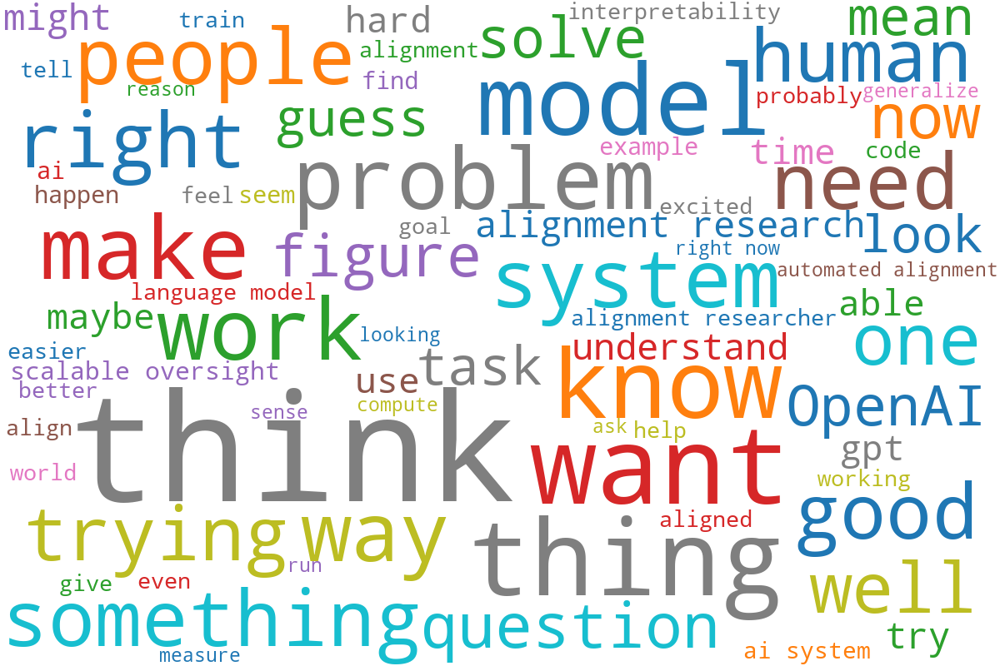

The two transcripts are from [AXRP](https://axrp.net/episode/2023/07/27/episode-24-superalignment-jan-leike.html) and [80,000 Hours](https://80000hours.org/podcast/episodes/jan-leike-superalignment/#interesting-work-on-scalable-oversight-010829).

I included in the transcripts not only Jan Leike's answers, but also the questions. The reason is because I wanted to represent the conversations.

## Cleaning

I did some cleaning on the transcripts.

- Removed cold open
- Removed punctuation
- Removed headings
- Changed to US spelling in 80,000 Hours transcript:
    - generalize
    - organization
- Converted to lower case (except OpenAI, because why not)

## Stopwords

I used the standard stopwords from the Python library plus those in the file `custom_stopwords.xlsx`.

## Result

Top 75 words from the transcripts. See `top-words.txt` for the list.

